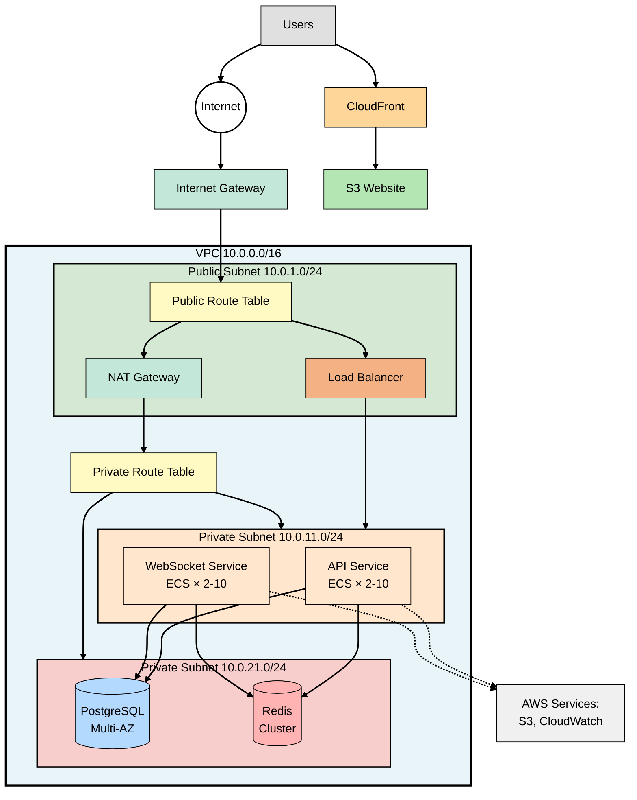
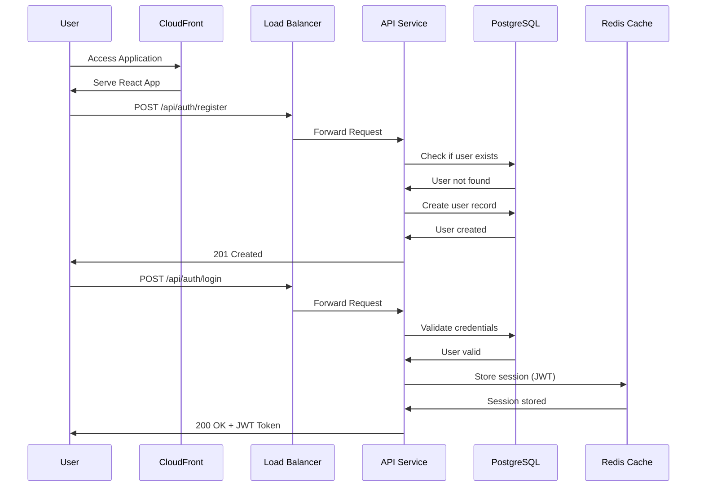
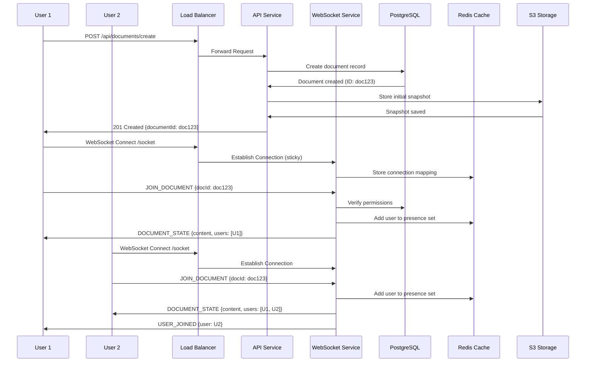
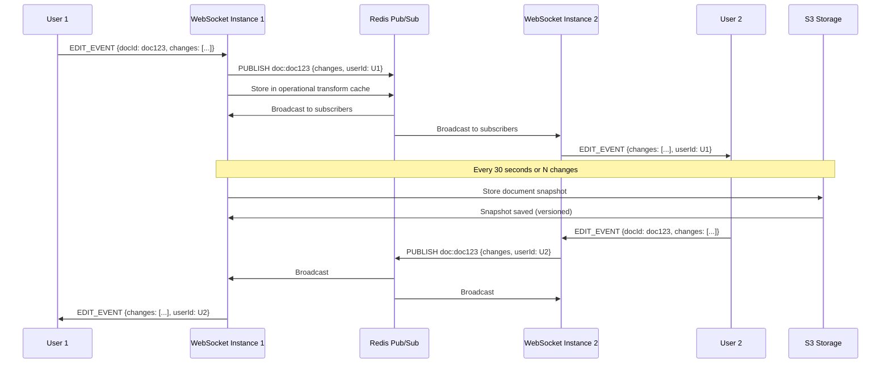

# CodeSync Infrastructure Diagram

## Main Architecture Diagram

## User Registration & Login Flow

## Create & Join Collaborative Document

## Real-Time Collaborative Editing

---

## How to Use

1. **View Online**: Copy any diagram and paste into https://mermaid.live/
2. **Export**: Download as PNG, SVG, or PDF
3. **Embed**: Use in Markdown files (GitHub, GitLab, Notion, etc.)

